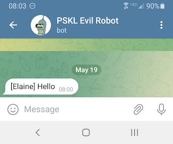

# gcode_telegram
A host module for Klipper that allows the sending of Telegram messages via gcode commands.  

This module has only been tested under Mainsail OS.  

# Installation

### Clone this repo and copy gcode_telegram.py to your Klipper "extras" folder.  
Under Mainsail OS:

```
git clone https://github.com/ericpskl/gcode_telegram
cd gcode_telegram
cp gcode_telegram.py /home/pi/klipper/klippy/extras
```

### Install the Python Requests module

``` 
cd ~
cd klippy-env/
source klippy-env/bin/activate
python -m pip install requests
```

### Create a Telegram Bot to use with Klipper

See https://core.telegram.org/bots/tutorial for instructions.  Make note of your bot's Token and Chat ID.

### Enable gcode_telegram in your printer.cfg.  

```
[gcode_telegram bot]
token:  <<token>>
chatid: <<chatid>
printer_name: Elaine
verbose: true
timeout: 5
```

### Test




### Add messaging to all the things!

For example, to get a Telegram message when there's a filament runout event:


```
[filament_switch_sensor filament_runout]

pause_on_runout: True

runout_gcode:
  SEND_TELEGRAM BOT=bot MESSAGE="Out of filament"
  G91
  G1 Z20 F900
  G90
  G1 X10 Y10 F5000
  G91
  G1 E-450 F600
  G90

insert_gcode:
  G4 P20000 # Pause for 20 seconds
  G1 E100 F400 # Prime the nozzle
  SEND_TELEGRAM BOT=bot MESSAGE="Don't forget to resume the print job!"
switch_pin: PA4
```

